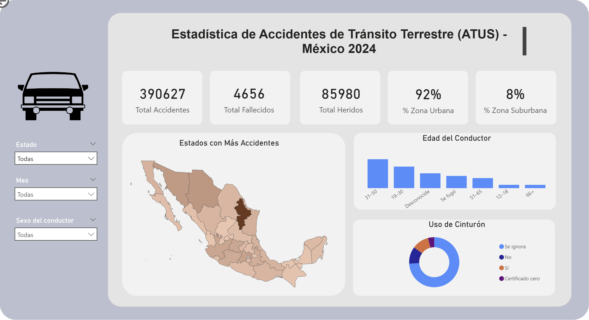

# PowerBI-Dashboard-Atus-2024
Dashboard interactivo desarrollado en Power BI utilizando el conjunto de datos oficial ATUS 2024 del INEGI.

# Objetivo del Proyecto
Analizar y visualizar los patrones de accidentes de tránsito en México y comparar las capacidades analíticas de Power BI frente a Excel.

# Características
- Medidas en DAX (KPIs, porcentajes)
- Filtrado dinámico
- Visualización geográfica
- Análisis por grupos de edad y sexo
- Métricas comparativas Urbano vs Suburbano

# Herramientas Utilizadas
- Power BI Desktop
- Power Query
- DAX

# Fuente de Datos
INEGI – Estadística de Accidentes de Tránsito Terrestre en Zonas Urbanas y Suburbanas (ATUS) 2024.
- URL: https://www.inegi.org.mx/programas/accidentes/#datos_abiertos

# Vista Previa

# Archivo Completo
Debido al tamaño del archivo, el dashboard en Power BI se encuentra disponible en el siguiente enlace:

🔗 [Descargar archivo Power BI – ATUS 2024](https://drive.google.com/drive/folders/1LvmwnymQsCJSASk6bYbDINAZd9kRRFZS?usp=sharing)
